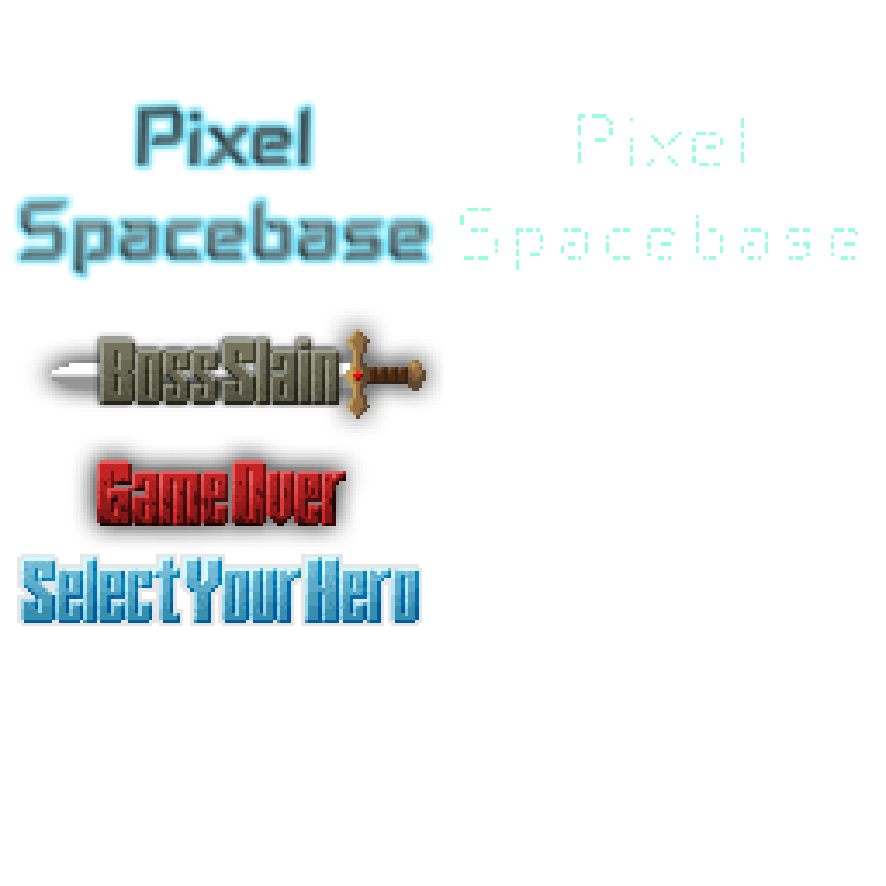

Pixel Spacebase
===============

This is a fork of Shattered Pixel Dungeon v4.3, based on Pixel Dungeon. I'm new to coding in a statically typed language like Java - this is primarily a hobby/learning project but I hope it might grow into a nice spin on the endless PD forks.

* Original by Watabou: https://github.com/watabou/pixel-dungeon
* Shattered by Evan D: https://github.com/00-Evan/shattered-pixel-dungeon

I started out with the original build of PD but ran into unending complications with the random level size generation. Since I decided that I wanted this to be a core feature (but also wanted to get on with my game changes), I opted for Shattered, but I'm not keen on the newer perspective, so forked the previous version with the original graphics.

Still, massive credit to Evan for reworking level generation - I stand on the shoulders of tiny pixel giants.



## What's Different?

The aim is to convert Pixel Dungeon into a fully fledged Spacebase Exploration/Escape RPG.

### Major Changes:

* 4 new characters
* Smoother gameplay
* Item tweaks
* Level size generation completely random
* Workshop generation

### Changes in progress:

* Reskin/Names of all textures and sprites
* Game tweaks
* Bug fixing
* Cached auto-aim pathfinding to reduce lag

### Changes planned:

The active backlog is tracked in [`PLAN.md`](PLAN.md). Current work is sorted into:

* Suggestions - unsettled ideas and design options before they become implementation tasks.
* Sprites - character, enemy, item, and equipment sprite work.
* Tiles - tileset, terrain, water, ladder, and floor-feature art or tile behavior.
* Mechanics - gameplay, persistence, quest, workshop, combat, and UI behavior changes.
* Cosmetic / Narrative - lore, naming, dialogue, area framing, and story polish.

When adding new work, put rough ideas in the Suggestions section first. Once the direction is chosen, move the item into the relevant work category and keep implementation batches small enough to test and rebuild quickly.

## Development Setup

Run `scripts/setup.sh` to install the Android SDK and NDK and create the required `local.properties` file. The script assumes a Debian-based system with `apt` available.

## Building and Installing on Android

1. Build the debug APK using:
   ```bash
   ./gradlew :core:assembleDebug
   ```
   The APK will be written to `core/build/outputs/apk/debug/core-debug.apk`.
2. Enable **Developer Options** and **USB debugging** on your device and connect it via USB.
3. Install the APK with `adb`:
   ```bash
   adb install -r core/build/outputs/apk/debug/core-debug.apk
   ```
   Alternatively, copy the APK to your phone and open it to sideload (allow "install unknown apps" when prompted).
4. You can also run `./gradlew :core:installDebug` to build and install in one step if a device is connected.

To execute the unit tests locally run:

```bash
./gradlew test
```

### macOS

macOS users can run `scripts/setup-macos.sh` instead. It uses Homebrew to
install OpenJDK 17 and downloads the Android SDK and NDK to
`$HOME/android-sdk`. After running the script, build the project with:

```bash
./gradlew build
```

To install the debug build on an emulator or connected device, run:

```bash
./gradlew installDebug
```

## Possible Improvements

* Update the Gradle wrapper or Android Gradle plugin so that the project builds without manual configuration.
* Provide signing instructions for release builds and additional platform setup notes.
