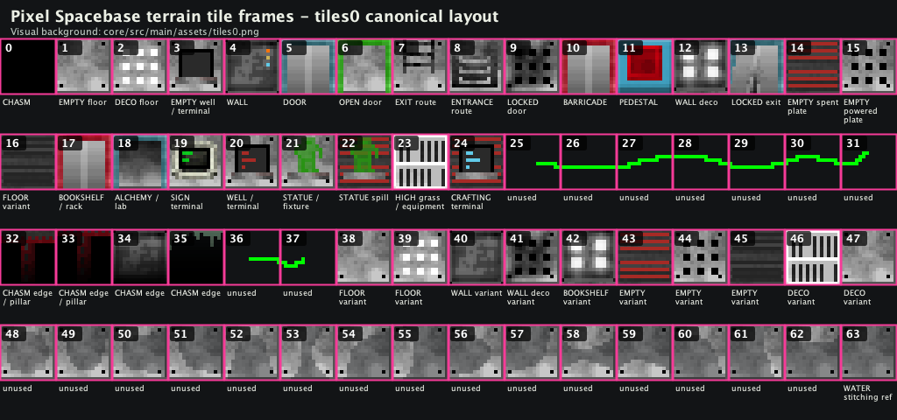

# Tile Sheet Layout

Use this when requesting or planning tile art changes:

The image is generated from the canonical Maintenance / Operations sheet, `core/src/main/assets/tiles0.png`, but the same frame layout applies to every terrain sheet:

- `tiles0.png` - Maintenance / Operations
- `tiles1.png` - Security Block
- `tiles2.png` - Lower Engineering
- `tiles3.png` - Habitation / Command Sector
- `tiles4.png` - Deep Containment

## Important Notes

- Frame numbers are tile-sheet frame numbers, not always terrain IDs.
- `ENTRANCE` and `EXIT` are visually swapped in the sheet mapping:
  - Frame `7` is `EXIT`, the next-deck route.
  - Frame `8` is `ENTRANCE`, the previous-deck route.
- `SECRET_DOOR`, `HIDDEN_VENT`, `VENT`, and `INACTIVE_VENT` do not have unique base frames in `SpacebaseTilemap`; they reuse wall/floor frames plus discovery or overlay behavior.
- `WATER` uses the separate `water*.png` animated texture in gameplay. Frame `63` is still listed because `SpacebaseTilemap` maps water there for stitching/reference behavior.
- Frames `38-47` are alternate variants used by the tile renderer for visual variety.
