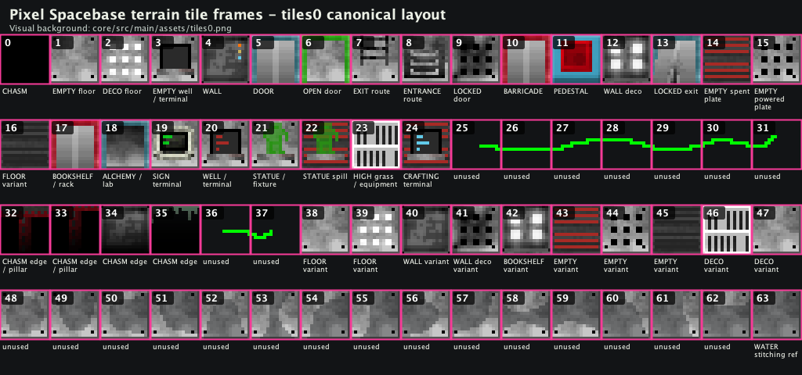

# Tile Sheet Layout

Use this when requesting or planning tile art changes:

The image is generated from the canonical Maintenance / Operations sheet, `core/src/main/assets/tiles0.png`, but the same frame layout applies to every terrain sheet:

- `tiles0.png` - Maintenance / Operations
- `tiles1.png` - Security Block
- `tiles2.png` - Lower Engineering
- `tiles3.png` - Habitation Ring
- `tiles4.png` - Command

## Important Notes

- Frame numbers are tile-sheet frame numbers, not always terrain IDs.
- `ENTRANCE` and `EXIT` are visually swapped in the sheet mapping:
  - Frame `7` is `EXIT`, the next-deck route.
  - Frame `8` is `ENTRANCE`, the previous-deck route.
- `SECRET_DOOR`, `HIDDEN_VENT`, `VENT`, and `INACTIVE_VENT` do not have unique base frames in `SpacebaseTilemap`; they reuse wall/floor frames plus discovery or overlay behavior.
- `WATER` uses the separate `water*.png` animated texture in gameplay. Frame `63` is still listed because `SpacebaseTilemap` maps water there for stitching/reference behavior.
- Frames `38-47` are alternate variants used by the tile renderer for visual variety.

## Habitat-specific floors

In `tiles3.png`, frame `1` contains the copied transporter floor artwork and supplies the normal deck floor (with variants `38` and `47`). Frame `64` remains the transporter-room floor, and frame `65` remains its wall. Frame `66` contains the original frame `1` artwork and supplies the changing-room dry floor, without random variants. Water and room fixtures retain their own visuals.

The changing-room fixtures now also use editable frames in `tiles3.png`:

| Frame (zero-based) | Artwork | Pixel origin (x, y) |
| --- | --- | --- |
| 66 | Bathroom floor | 128, 256 |
| 67 | Shower | 192, 256 |
| 68 | Lockers | 256, 256 |
| 69 | Steam vent grille | 320, 256 |

Each frame is 64 × 64 pixels on the asset sheet, rendered at 16 × 16 game units. Fixture art was copied exactly from `ChangingRoomArtwork` with nearest-neighbour enlargement; that class is retained as the original artwork reference, and is no longer used to draw fixtures at runtime. The saved fixture kinds remain unchanged. Steam particles are still emitted separately.
